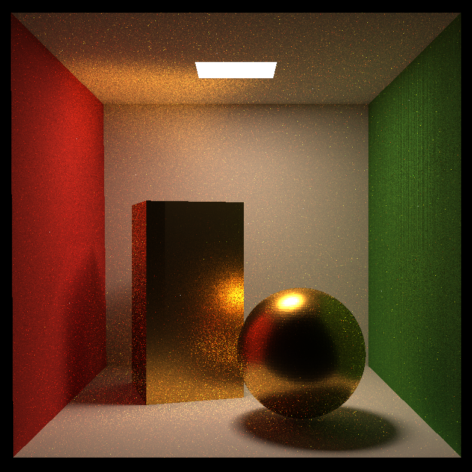
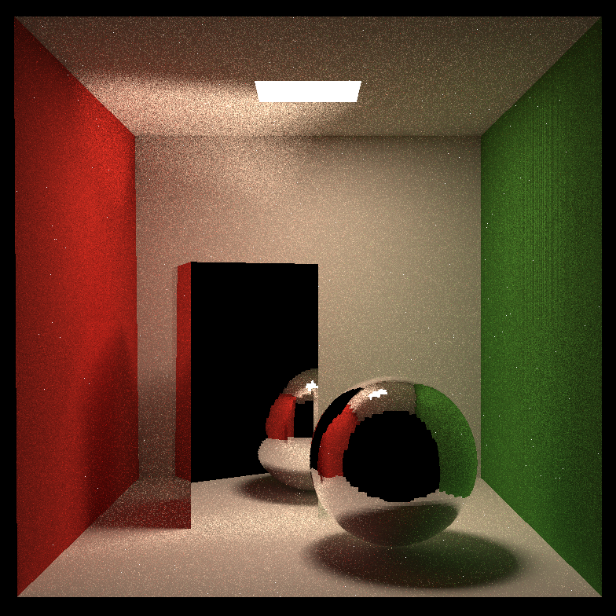
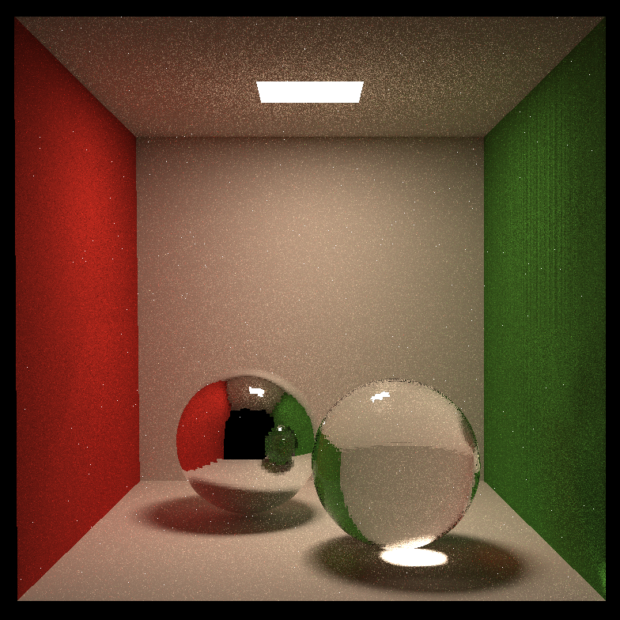

# YZircon's Global Illumination

An implementation of useful GI Algorithms, using C/C++

------

  <picture>
    
  </picture>
  <picture>
    
  </picture>
  <picture>
    
  </picture>

The sphere and tall box in the left image use microfacet material, while the other objects use diffuse material. It was rendered in 4142 seconds at 1024 samples per pixel (spp).

The sphere and tall box in the middle image use material based on the Fresnel reflection equations, while other objects use diffuse material. And it was rendered in 3582 seconds at 1024 spp.

The left sphere in the right image uses mirror material, and the right sphere uses glass material, while other objects use diffuse material. It was rendered in 4382 seconds at 1024 spp.

All of the images were rendered by YZGI.

------

## Features (Working now)

**Model**

.obj/.mtl

**Rendering**

- [x] Path-Tracing
- [ ] Photon Mapping

**Materials**

- [x] Lambert Diffuse BRDF

- [x] Pure Specular BRDF

  - Fresnel Equation Based

- [x] Glass BSDF
  
  - Combination of pure reflection and pure refraction.

- [x] Microfacet BRDF

  - Cook Torrance GGX
  
**Sampling**

- [ ] Multiple Importance Sampling

**Color Space**

- By default, colors are defined in the linear sRGB/Rec.709 color space

- You can adjust according to your needs, but it is recommended to ensure that all colors in the entire renderer are defined in the **same** color space

- And make sure it's a linear color space to get rid of physical errors

## Build & Run

## Source Files

| Filename                    | Feature                                  |
|-----------------------------|------------------------------------------|
| Core/main.cpp               | Program Core                             |
| Core/Renderer.*             | Renderer Core                            |
| Core/Material.*             | Class Material, defined by BSDF          |
| Core/Texture.*              | Class Texture                            |
| Core/Sampler.*              | Class Sampler, used to sample from Texture |
| Core/Ray.hpp                | Just a Ray                               |
| Core/Scene.*                | Scene                                    |
| Core/Intersection.hpp       | An Intersection                          |
| Core/Triangle.hpp           | Triangle and Mesh                        |
| Core/global.hpp             | Some Global Functions                    |
| Core/Integrator.hpp         | The public class of Integrators          |
| Core/Bounds3.hpp            | 3D Bounding Box                          |
| DS/BVH.*                    | BVH Accelerating Data Structure          |
| DS/KDTree.*                 | K-D Tree Accelerating Data Structure     |
| Integrators/PathTracing.*   | Simple Path Tracing Integrator           |
| Integrators/PhotonMapping.* | Photon Mapping Tracing Integrator        |

## Classes

| Name                  | Dependency                      | Feature                                                |
|-----------------------|---------------------------------|--------------------------------------------------------|
| Renderer              | Scene                           | Main Renderer                                          |
| Material              | Texture(TBD), Sampler(TBD)      | Material                                               |
| Scene                 | Ray, Object                     | Scene                                                  |
| Object                | None                            | Virtual base class for all kinds of model object       |
| Texture               | TBD                             | Texture                                                |
| Sampler               | TBD                             | Sample the texture                                     |
| Ray                   | None                            | Just a Ray                                             |
| Intersection          | Object, Material                | An Intersection                                        |
| Triangle              | Object                          | A Triangle                                             |
| Mesh                  | Triangle, Object                | A set of Triangle, with a bounding box                 |
| BVH                   | Object,Ray,Intersection,Bounds3 | An Accelerating Data Structure stores Objects in Scene |
| Bounds3               | None                            | Bounding Box                                           |
| Integrator            | Ray, Scene                      | Public Class of Integrators                            |
| PathTracingIntegrator | Ray, Intersection, Scene        | Implementation of Path Tracing Integrator              |

## Resources

### 3rd Party Libraries

- Eigen, a C++ template library for linear algebra: matrices, vectors, numerical solvers, and related algorithms, https://gitlab.com/libeigen/eigen
- OBJ-Loader, A C++ OBJ Model Loader that will parse .obj & .mtl Files into Indices, Vertices, Materials, and Mesh Structures, https://github.com/Bly7/OBJ-Loader, I modified some of them to support more descriptions in the obj file, the new code follows the license of this project.
- stb, single-file public domain(or MIT License) libraries for C/C++, https://github.com/nothings/stb

### Models

- The Cornell Box, https://www.graphics.cornell.edu/online/box/

