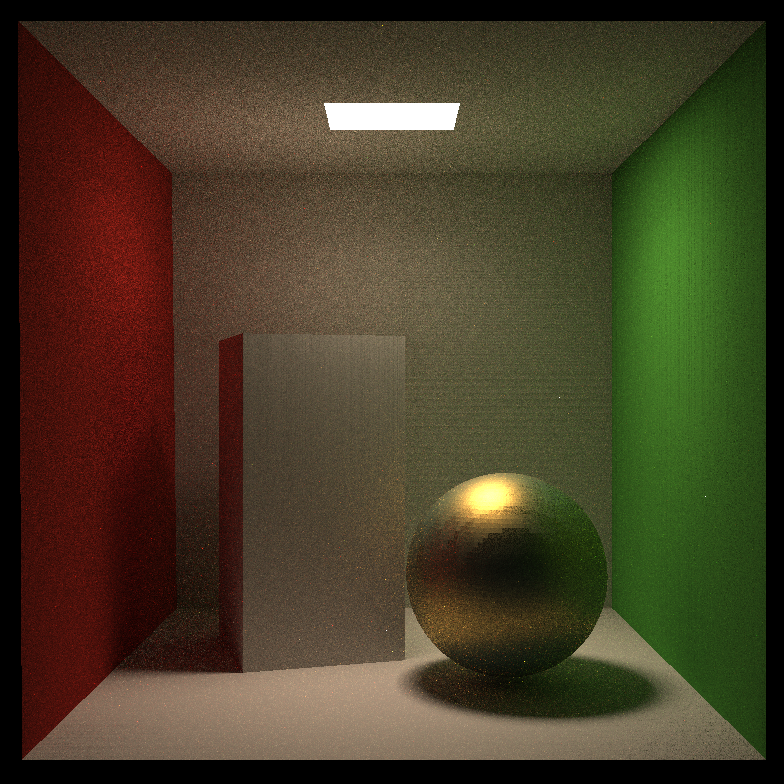
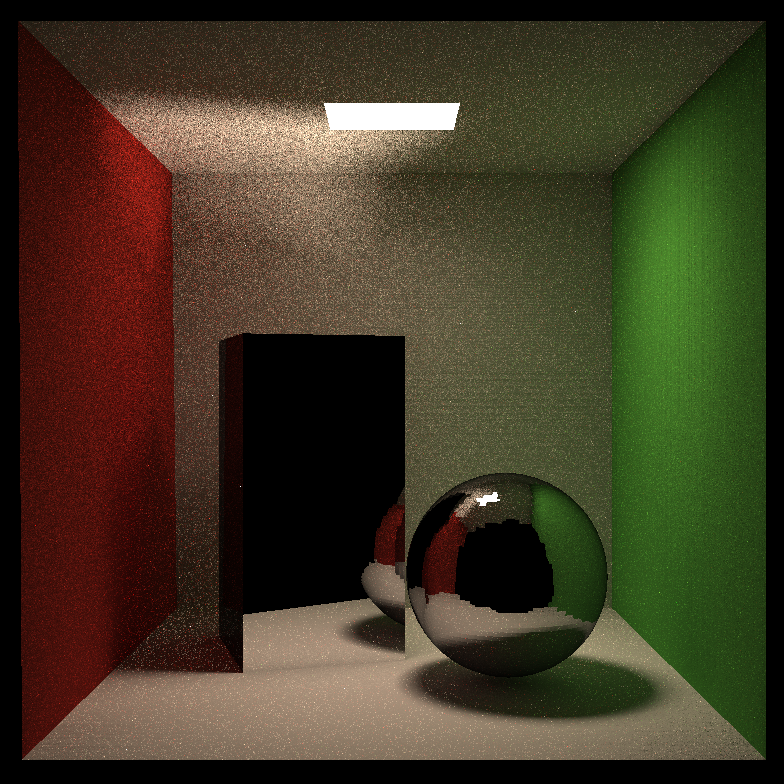

# YZircon's Global Illumination

An implementation of useful GI Algorithms, using C/C++

------

  <picture>
    
  </picture>
  <picture>
    
  </picture>

The sphere in the left picture uses microfacet material, while other objects use diffuse material. The left picture was rendered by YZGI, with 128 samples per pixel(spp), in 360 seconds.

The tall box and the sphere in the right picture use mirror material based on the Fresnel reflection equations, while other objects use diffuse material. It's rendered by YZGI, with 1024 spp, in 2610 seconds.

------

## Features (Working now)

**Model**

.obj/.mtl

**Rendering**

- [x] Path-Tracing
- [ ] Photon Mapping

**Materials**

- [x] Diffuse BRDF

- [x] Microfacet BRDF

  - Cook Torrance GGX

**Sampling**

- [ ] Multiple Importance Sampling

## Build & Run

## Source Files

| Filename         | Feature                                    |
|------------------|--------------------------------------------|
| main.cpp         | Program Core                               |
| Renderer.cpp/h   | Renderer Core                              |
| Material.cpp/h   | Class Material, defined by BRDF            |
| Texture.cpp/h    | Class Texture                              |
| Sampler.cpp/h    | Class Sampler, used to sample from Texture |
| Ray.hpp          | Just a Ray                                 |
| Scene.cpp/h      | Scene                                      |
| Intersection.hpp | An Intersection                            |
| Triangle.hpp     | Triangle and Mesh                          |

## Classes

| Name         | Dependency                      | Feature                                                |
| ------------ | ------------------------------- | ------------------------------------------------------ |
| Renderer     | Scene                           | Main Renderer                                          |
| Material     | Texture(TBD), Sampler(TBD)      | Material                                               |
| Scene        | Ray, Object                     | Scene                                                  |
| Object       | None                            | Virtual base class for all kinds of model object       |
| Texture      | TBD                             | Texture                                                |
| Sampler      | TBD                             | Sample the texture                                     |
| Ray          | None                            | Just a Ray                                             |
| Intersection | Object, Material                | An Intersection                                        |
| Triangle     | Object                          | A Triangle                                             |
| Mesh         | Triangle, Object                | A set of Triangle, with a bounding box                 |
| BVH          | Object,Ray,Intersection,Bounds3 | An Accelerating Data Structure stores Objects in Scene |
| Bounds3      | None                            | Bounding Box                                           |

## Resources

### 3rd Party Libraries

- Eigen, a C++ template library for linear algebra: matrices, vectors, numerical solvers, and related algorithms, https://gitlab.com/libeigen/eigen
- OBJ-Loader, A C++ OBJ Model Loader that will parse .obj & .mtl Files into Indices, Vertices, Materials, and Mesh Structures, https://github.com/Bly7/OBJ-Loader, I modified some of them to support more descriptions in the obj file, the new code follows the license of this project.
- stb, single-file public domain(or MIT License) libraries for C/C++, https://github.com/nothings/stb
- nlohmann/json, JSON parser for Modern C++, https://github.com/nlohmann/json

### Models

- The Cornell Box, https://www.graphics.cornell.edu/online/box/

